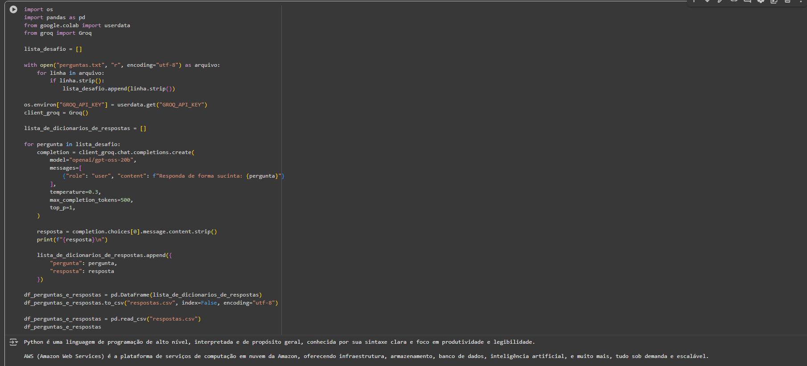

# Projetos do Curso: Python e Inteligência Artificial Aplicada (Alura)

> Status: Concluído ✅

## 📖 Sobre o Repositório

Este repositório contém os projetos práticos desenvolvidos durante o curso **"Python: Inteligência Artificial Aplicada"** da Alura. O foco foi utilizar a linguagem Python para interagir com APIs de modelos de linguagem (LLMs), como Gemini e OpenAI, a fim de automatizar tarefas e criar soluções inteligentes.

Aqui, você encontrará exemplos de como consumir APIs, manipular dados com Pandas, tratar exceções e aplicar IA generativa a problemas práticos.

## 🛠️ Tecnologias e Conceitos Abordados

- **Linguagem:** Python
- **Bibliotecas Principais:** Pandas, Groq
- **APIs e Modelos de IA:** Google Gemini, OpenAI (via Groq)
- **Ambiente de Desenvolvimento:** Google Colab
- **Principais Conceitos:**
  - Consumo de APIs REST
  - IA Generativa e Engenharia de Prompts
  - Manipulação e Análise de Dados
  - Leitura e Escrita de Arquivos (`.txt`, `.csv`)
  - Tratamento de Exceções (`Try`, `Except`, `Finally`)

## 🚀 Projetos Desenvolvidos

Neste curso, dois projetos principais foram criados para aplicar o conhecimento de forma prática:

### 1. Resumidor de E-mails com Gemini

- **Objetivo:** Criar uma ferramenta capaz de ler o conteúdo de múltiplos e-mails e gerar um resumo conciso de uma linha para cada um, otimizando a produtividade.
- **Como funciona:** O script recebe uma lista de textos (corpos dos e-mails) e, para cada um, faz uma chamada à API do Gemini com um prompt específico, solicitando um resumo sucinto. O resultado é exibido e armazenado.
- **Tecnologias:** Python, Google Colab, API do Google Gemini.

### 2. FAQ Interativo com Groq e OpenAI

- **Objetivo:** Desenvolver um sistema de Perguntas e Respostas (FAQ) que utiliza um LLM para fornecer explicações claras sobre temas pré-definidos.
- **Como funciona:** O script lê uma lista de perguntas de um arquivo de texto. Em seguida, utiliza a biblioteca `Groq` para se conectar de forma performática à API da OpenAI (modelo `gpt-3.5-turbo`), enviando cada pergunta e recebendo uma resposta formatada.
- **Tecnologias:** Python, Biblioteca Groq, API da OpenAI.

## 👨‍💻 Autor

**Matheus Farias Dos Santos**

- [LinkedIn](https://www.linkedin.com/in/matheus-farias-0822b5269/)
- [GitHub](https://github.com/MatheusFarias15)# Inteligencia_Artificial_Aplicada

